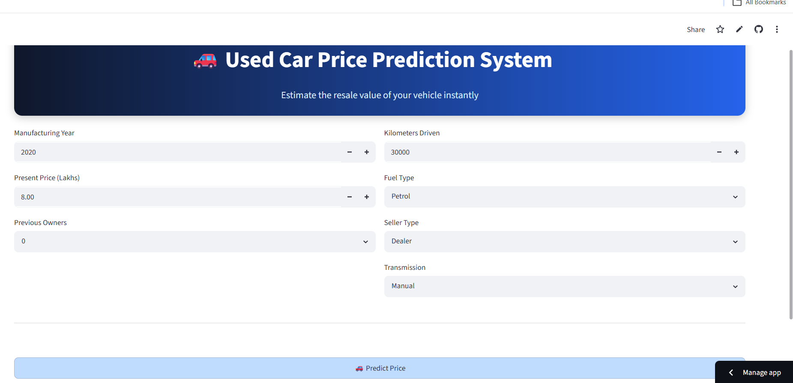
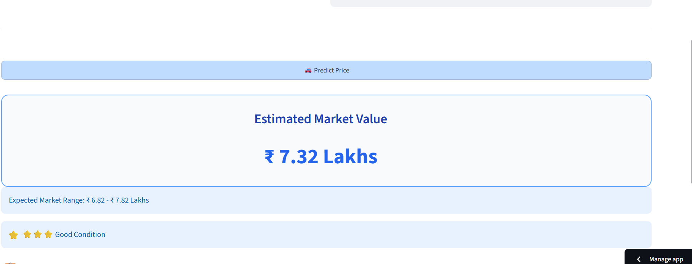

# 🚗 Used Car Price Prediction System

## 📌 Project Overview

The **Used Car Price Prediction System** is a Machine Learning web application that predicts the resale value of a used car based on vehicle specifications. The project demonstrates an end-to-end machine learning workflow, including data preprocessing, feature engineering, model training, evaluation, and deployment using Streamlit.

---

## 🎯 Objectives

* Predict the selling price of a used car.
* Apply feature engineering to improve prediction performance.
* Develop an interactive web application for real-time predictions.
* Demonstrate a complete Machine Learning pipeline.

---

## 📂 Dataset

**Dataset:** Cardekho Used Car Dataset

### Features Used

* Manufacturing Year
* Present Price
* Kilometers Driven
* Fuel Type
* Seller Type
* Transmission
* Previous Owners

**Target Variable:** Selling Price

---

## ⚙️ Feature Engineering

The following features were created to improve prediction accuracy:

* Car_Age
* Mileage_per_Year
* Log_Kms_Driven
* Age_Group_Old

---

## 🛠️ Technologies Used

* Python
* Pandas
* NumPy
* Scikit-learn
* Streamlit
* Joblib
* Git & GitHub

---

## 📊 Machine Learning Workflow

1. Data Collection
2. Data Preprocessing
3. Exploratory Data Analysis
4. Feature Engineering
5. Model Training
6. Model Evaluation
7. Streamlit Web Application
8. Deployment

---

## 🚀 Web Application Features

* Interactive User Interface
* Real-Time Price Prediction
* Estimated Market Value
* Expected Market Price Range
* Vehicle Condition Indicator
* Vehicle Summary

---

## 📈 Model Evaluation

The model was evaluated using:

* R² Score
* Mean Absolute Error (MAE)
* Mean Squared Error (MSE)
* Root Mean Squared Error (RMSE)

---

## 📸 Application Preview

### 🏠 Home Page



---

### 💰 Prediction Result



---

### 📋 Vehicle Summary


---

## 🌐 Live Demo

**Streamlit Application**

https://used-car-price-prediction-webapp.streamlit.app/

---

## 📁 Project Structure

```text
Used-Car-Price-Prediction/
│
├── app.py
├── notebook.ipynb
├── README.md
├── requirements.txt
├── src
├── screenshots
       
```

---

## 🔮 Future Enhancements

* Train tree-based models such as Random Forest and XGBoost.
* Incorporate additional vehicle attributes such as brand and engine specifications.
* Store prediction history using a database.
* Deploy the model using REST APIs.


